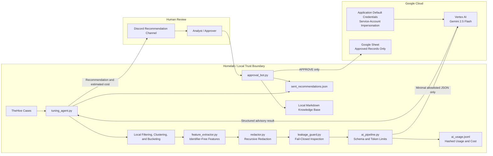

# Tuning Agent MVP

The Tuning Agent MVP is a Python-based workflow for identifying repeated security alert noise, drafting narrowly scoped tuning recommendations, and routing those recommendations through human approval before anything is treated as safe.

The goal is not to auto-suppress alerts. The goal is to help analysts and managers see where repeated false-positive or duplicate case volume exists, preserve the evidence behind each recommendation, and create an auditable feedback loop for better detection tuning over time.

## Executive Summary

Security teams often spend time reviewing repeated cases that have already been closed as false positives or duplicates. This project looks for those repeat patterns, groups similar cases together, and proposes tuning candidates that can reduce future noise without hiding meaningful risk.

At a high level, the agent:

- Pulls recent case data from TheHive.
- Finds repeated cases with false-positive or duplicate disposition language.
- Groups cases by stable security context, such as rule ID, host/agent, CVE, file path, or process.
- Classifies the alert type into a bucket such as vulnerability, IOC, authentication, endpoint process, cloud, network, email, or privilege activity.
- Builds a streamlined recommendation with local tuning logic, AI mode/decision, safety notes, token usage, and estimated cost.
- Posts the recommendation to Discord for analyst review.
- Records analyst decisions back into local state and knowledge-base files.
- Optionally sends approved recommendations to a Google Apps Script webhook for tracking in a sheet or external approval record.

## Current Status

This is an MVP intended for review, demonstration, and controlled analyst workflow testing. It is designed around human-in-the-loop approval and local knowledge-base learning.

### Vertex AI Integration Status

- Authentication: Complete and verified with Application Default Credentials.
- Authentication method: Service-account impersonation; no service-account key is stored in this repository.
- Google Cloud project: Configured locally through ignored environment settings.
- Impersonated service account: Configured locally; identifier intentionally omitted from the public repository.
- Vertex location: `us-central1`.
- Configured model: `gemini-2.5-flash`.
- Runtime mode: `vertex`.
- ADC verification: `gcloud auth application-default print-access-token` completed successfully on September 23, 2026, with token output discarded.
- Credential contents are not inspected, logged, or committed by this project.

The current implementation supports:

- TheHive case retrieval.
- Discord recommendation delivery.
- Discord approval command handling.
- Vertex AI Gemini advisory analysis through Application Default Credentials.
- Provider-neutral AI boundary with disabled, redaction-only, and mock test modes.
- Conservative `REVIEW` fallback when external AI is disabled, blocked, or unavailable.
- Local Markdown knowledge-base updates for approved, rejected, stale, and drifted tuning examples.
- Local recommendation state tracking to avoid repeatedly sending the same cluster.

## Workflow

1. `tuning_agent.py` queries TheHive for recent cases.
2. Cases are filtered for false-positive or duplicate indicators.
3. Matching cases are grouped into clusters using `rule_id`, `agent`, and the most specific available indicator.
4. Each cluster is classified by `alert_bucket.py`.
5. `feature_extractor.py` converts raw cases into an identifier-free allowlisted schema.
6. `redactor.py` and `leakage_guard.py` inspect the exact outbound payload locally.
7. `ai_pipeline.py` blocks unsafe payloads or sends the minimal payload to Vertex AI.
8. Vertex returns a schema-constrained advisory decision; real tuning logic remains local.
9. Token usage and estimated cost are written to ignored local telemetry.
10. The streamlined recommendation is posted to Discord.
11. An analyst responds with `APPROVE`, `REJECT`, `REVIEW`, `STALE`, or `DRIFT`.
12. `approval_bot.py` updates local state and the appropriate knowledge-base lane.

## System Topology



### Data boundary

| Boundary | Data allowed |
| --- | --- |
| TheHive to local agent | Full case data over the homelab connection. |
| Local agent to Vertex AI | Alert bucket, counts, booleans, disposition, and allowlisted context/risk flags only. |
| Vertex AI to local agent | Advisory decision, rationale, risk, validation steps, and token metadata. |
| Local agent to Discord | Human-readable recommendation, local evidence, AI decision, safety notes, and estimated cost. |
| Approval bot to Google Sheet | Approved recommendation record only. Rejected/review/stale decisions remain local. |

Users, hosts, IP addresses, paths, command lines, process names, rule IDs, case IDs,
analyst notes, raw cases, and knowledge-base documents are excluded from the Vertex
AI request.

## Human Approval Model

The agent is intentionally advisory. It does not directly deploy tuning changes.

Analysts review each recommendation and respond with one of the following commands:

```text
APPROVE TR-ID-HERE why this is safe
REJECT TR-ID-HERE why this is unsafe
REVIEW TR-ID-HERE what needs more validation
DRIFT TR-ID-HERE what changed from the previous tuning context
STALE TR-ID-HERE why the previous tuning context is no longer valid
```

Approved recommendations are recorded as positive examples. Rejected recommendations become negative examples. Stale or drifted recommendations are recorded separately so the agent can avoid blindly reusing old approval context when the environment changes.

## AI Usage Boundary

AI is limited to advisory analysis of a minimal structured payload. The active
provider is Gemini 2.5 Flash on Vertex AI, authenticated through impersonated
Application Default Credentials.

The agent does not use AI to:

- Decide which cases to pull from TheHive.
- Query or modify TheHive.
- Decide which cases qualify as false positives or duplicates.
- Build cluster keys.
- Classify alert buckets.
- Approve recommendations.
- Deploy tuning changes.

Those steps are handled by deterministic Python logic, keyword matching, local configuration, and human analyst decisions.

Raw cases, knowledge-base documents, rule IDs, hosts, users, IP addresses, paths,
case IDs, and indicators are excluded from the provider request. Deterministic local
feature extraction produces only counts, booleans, an alert bucket, and allowlisted
context/risk flags. The exact outbound payload is redacted and scanned again before
dispatch. Any leakage finding blocks the request and returns `REVIEW`.

The provider may return only an advisory decision, rationale, risk, and validation
steps. Deployable tuning logic and real identifiers are assembled locally and still
require human approval.

## Safety Guardrails

The MVP uses several guardrails to keep recommendations narrow:

- Recommendations are grouped around stable fields such as rule ID, host/agent, CVE, file path, process, or other indicators.
- The prompt explicitly rejects broad tuning patterns such as global rule suppression.
- Proposed logic must reference the rule ID.
- Proposed logic must reference the host/agent when one is available.
- Proposed logic must reference the correlation indicator when one is available.
- The safety validator downgrades risky recommendations to `REVIEW`.
- Analyst approval is required before a recommendation is considered accepted.
- Knowledge-base feedback is separated by approval lane so rejected patterns do not become positive examples.

Examples of intentionally unsafe patterns:

- Suppressing an entire detection rule globally.
- Suppressing all alerts from a host.
- Suppressing all PowerShell activity.
- Suppressing all vulnerability detections.
- Tuning IOC alerts without confirmed benign or allowlisted context.
- Hiding privilege changes without a known approved admin workflow.

## Alert Buckets

`alert_bucket.py` classifies clusters into broad alert families. Each family has a preferred grouping strategy and a tuning goal.

| Bucket | Purpose |
| --- | --- |
| `vulnerability` | Reduce duplicate vulnerability case creation while preserving vulnerability visibility. |
| `ioc` | Avoid suppressing malicious indicators unless they are confirmed benign or allowlisted. |
| `endpoint_process` | Tune exact known-benign process behavior while preserving suspicious variants. |
| `authentication` | Reduce known benign authentication noise while preserving visibility for new users, privileged users, and new sources. |
| `identity_privilege` | Preserve visibility for privilege changes and tune only approved recurring admin workflows. |
| `cloud` | Reduce expected cloud service or admin activity while preserving unusual principals, regions, and sensitive actions. |
| `network` | Tune known benign network patterns while preserving new destinations and suspicious ports or protocols. |
| `email` | Avoid broad phishing suppression and tune only known benign sender or campaign patterns. |
| `generic` | Use conservative review-first handling when the alert type is unclear. |

## Repository Structure

| Path | Description |
| --- | --- |
| `tuning_agent.py` | Main recommendation generator. Pulls TheHive cases, groups clusters, builds recommendations, and posts to Discord. |
| `approval_bot.py` | Discord bot that handles analyst decisions and updates local state and knowledge-base files. |
| `approve_tuning.py` | Command-line helper for approving a specific recommendation ID. |
| `alert_bucket.py` | Alert-family classifier and bucket metadata. |
| `feedback_interpreter.py` | Converts analyst decisions into structured behavior-change metadata. |
| `knowledge_retriever.py` | Simple keyword retrieval over local Markdown knowledge documents. |
| `ai_schema.py` | Strict allowlisted request and response contracts for external AI. |
| `feature_extractor.py` | Converts raw case clusters into identifier-free abstract features. |
| `redactor.py` | Recursively masks sensitive strings as a second defensive layer. |
| `leakage_guard.py` | Blocks payloads containing sensitive fields or known values. |
| `ai_pipeline.py` | Enforces validation, redaction, leakage inspection, limits, and dispatch. |
| `ai_provider.py` | Provider-neutral interface that keeps the workflow replaceable. |
| `providers/vertex_ai_provider.py` | Vertex adapter with structured output and fail-closed handling. |
| `providers/local_providers.py` | Disabled, redaction-only, and mock providers for safe testing. |
| `ai_usage.py` | Writes privacy-preserving token and estimated-cost telemetry. |
| `cost_analysis.py` | Summarizes observed usage and projects costs by run volume. |
| `vertex_smoke_test.py` | Shows the outbound payload or performs one synthetic Vertex test. |
| `seed_workflow_test_cases.py` | Creates a unique qualifying synthetic TheHive cluster. |
| `knowledge_base/` | Local tuning examples, SOC tuning guidance, MITRE notes, and feedback history. |
| `seed_*.py` | Test/demo scripts for creating sample cases. |
| `.env.example` | Safe configuration template. Real secrets belong in `.env`, which is ignored by Git. |
| `requirements.txt` | Python dependencies. |

## Knowledge Base

The local knowledge base gives the agent memory without requiring an external vector database.

Important files include:

- `knowledge_base/approved_tuning_examples.md`
- `knowledge_base/rejected_tuning_examples.md`
- `knowledge_base/stale_tuning_examples.md`
- `knowledge_base/feedback_change_log.md`
- `knowledge_base/tuning_ideology.md`
- `knowledge_base/soc_tuning_skillset.md`
- `knowledge_base/mitre_attack_notes.md`

`knowledge_retriever.py` retains the original keyword-retrieval capability, but raw
knowledge-base documents are not included in Vertex requests. Approval feedback and
examples remain local for audit and future deterministic evaluation work.

## Configuration

Create a local `.env` from the template:

```bash
cp .env.example .env
```

Expected settings:

| Variable | Description |
| --- | --- |
| `THEHIVE_URL` | Base URL for TheHive. |
| `THEHIVE_API_KEY` | API key used to query TheHive cases. |
| `DISCORD_WEBHOOK_URL` | Discord webhook used by `tuning_agent.py` to post recommendations. |
| `DISCORD_BOT_TOKEN` | Discord bot token used by `approval_bot.py`. |
| `APPROVAL_CHANNEL_ID` | Discord channel ID where approval commands are accepted. |
| `APPS_SCRIPT_WEBHOOK_URL` | Optional Google Apps Script webhook for approved recommendation tracking. |
| `APPS_SCRIPT_SECRET` | Shared secret for the Apps Script webhook. |
| `APPROVER` | Default approver name for command-line approval workflows. |
| `AI_MODE` | `disabled`, `redaction-only`, `mock`, or `vertex`. |
| `AI_PROVIDER` | Provider family recorded for deployment documentation. |
| `AI_MODEL` | Vertex AI Gemini model ID. |
| `GOOGLE_CLOUD_PROJECT` | Google Cloud project used for Vertex AI quota and billing. |
| `GOOGLE_CLOUD_LOCATION` | Vertex AI processing location approved by the client. |
| `AI_INPUT_COST_PER_MILLION_TOKENS` | Configurable input-token rate used for estimates. |
| `AI_OUTPUT_COST_PER_MILLION_TOKENS` | Configurable output-token rate used for estimates. |
| `LOOKBACK_DAYS` | Number of days described in the recommendation summary. |
| `MIN_OCCURRENCES` | Minimum cluster size before a recommendation is sent. |

`DISCORD_APPROVAL_CHANNEL_ID` is also accepted as a backwards-compatible alias for
`APPROVAL_CHANNEL_ID`.

## Setup

Create and activate a virtual environment:

```bash
python3 -m venv venv
source venv/bin/activate
```

Install dependencies:

```bash
pip install -r requirements.txt
```

Create local configuration:

```bash
cp .env.example .env
```

Then fill in `.env` with the appropriate local values.

## Provider-Independent AI Testing

Use `redaction-only` while inspecting the local security boundary. It validates the
minimal payload but performs no external AI request:

```bash
AI_MODE=redaction-only
```

Use `mock` for deterministic end-to-end tests. The mock always returns `REVIEW` and
does not perform network activity:

```bash
AI_MODE=mock
```

Use `disabled` to bypass analysis entirely. Any unsupported provider name fails
closed. Only explicitly configured provider adapters are allowed.

The only fields permitted across the provider boundary are:

```text
schema_version, alert_bucket, occurrence_count, lookback_days,
same_rule, same_host, same_indicator, disposition,
context_flags, risk_flags
```

The provider interface cannot accept raw case dictionaries. Before dispatch, the
serialized payload is recursively redacted and scanned for sensitive field names,
IP addresses, emails, URLs, internal domains, file paths, secrets, and known values
from the local cluster. A finding or token-limit violation prevents the network call
and returns `REVIEW`.

Token estimates are appended to the ignored local file `ai_usage.jsonl`. Generate a
cost summary with:

```bash
python cost_analysis.py
```

Cost estimates use configurable per-million-token rates. The current Gemini 2.5
Flash standard-rate baseline, verified September 23, 2026, is `$0.30` per million
input tokens and `$2.50` per million output tokens. Confirm the effective rates
against the client's Cloud Billing SKUs and negotiated contract before treating the
report as an invoice. Usage records contain token counts, provider/model names, block
categories, and a SHA-256 hash of the recommendation ID; prompts and raw identifiers
are not written to the usage log.

Pricing reference: [Google Cloud generative AI pricing](https://cloud.google.com/gemini-enterprise-agent-platform/generative-ai/pricing).

### Cost calculation

Each request uses this estimate:

```text
(input_tokens / 1,000,000 × input_rate)
+ (output_tokens / 1,000,000 × output_rate)
```

Using the configured baseline rates and a representative run of 201 input tokens
and 252 output tokens:

| Usage | Input tokens | Output tokens | Estimated cost (USD) |
| ---: | ---: | ---: | ---: |
| 1 recommendation | 201 | 252 | $0.0006903 |
| 100 recommendations | 20,100 | 25,200 | $0.06903 |
| 1,000 recommendations | 201,000 | 252,000 | $0.6903 |
| 10,000 recommendations | 2,010,000 | 2,520,000 | $6.903 |

Run `python cost_analysis.py` to calculate projections from actual local telemetry.
The report excludes disabled, mock, and redaction-only records from billable averages.

## Vertex AI Setup

Vertex mode uses Google's official `google-genai` SDK and Application Default
Credentials. For local development, prefer service-account impersonation rather
than downloading a long-lived service-account key:

```bash
gcloud auth application-default login \
  --impersonate-service-account SERVICE_ACCOUNT@PROJECT.iam.gserviceaccount.com
```

This homelab is configured to use service-account impersonation. ADC was verified
non-destructively with access-token output redirected to `/dev/null`; the project,
service-account identifier, and credential contents remain in local configuration
and are not committed.

Configure the approved project, region, and model while leaving the agent in
`redaction-only` mode:

```env
AI_MODE=redaction-only
AI_PROVIDER=vertex-ai
AI_MODEL=gemini-2.5-flash
GOOGLE_CLOUD_PROJECT=client-project-id
GOOGLE_CLOUD_LOCATION=us-central1
GOOGLE_GENAI_USE_VERTEXAI=true
```

After the synthetic smoke test and outbound-payload review pass, activate Vertex:

```env
AI_MODE=vertex
```

Preview the exact synthetic boundary without a network call:

```bash
python vertex_smoke_test.py --show-payload
```

This prints only the exact post-redaction, identifier-free JSON that would cross the
Vertex boundary. It never prints raw cases or the redaction mapping.

After ADC and the project are configured, perform one explicit, potentially billable
synthetic request:

```bash
python vertex_smoke_test.py --live
```

To stop external inference immediately, restore `AI_MODE=redaction-only`. Provider
errors, invalid JSON, schema violations, leakage findings, and token-limit violations
all fail closed to `REVIEW`.

## Running the Agent

Generate and send tuning recommendations:

```bash
python tuning_agent.py
```

Run the Discord approval bot:

```bash
python approval_bot.py
```

Approve a recommendation from the command line:

```bash
python approve_tuning.py TR-ID-HERE "approval notes"
```

## End-to-End Workflow Test

Preview a fresh synthetic cluster without changing TheHive:

```bash
python seed_workflow_test_cases.py --dry-run
```

Create the qualifying cases and run the recommendation workflow:

```bash
python seed_workflow_test_cases.py
python tuning_agent.py
```

The seeder creates `MIN_OCCURRENCES` clearly labeled false-positive/duplicate test
cases for an approved inventory process on a dedicated synthetic host. Each run uses
a new cluster ID, preventing old recommendation state from causing the test to be
skipped.

## Recommendation Output

Each Discord recommendation includes:

- Recommendation ID.
- Alert bucket.
- Detection source and rule ID.
- Case count and example case IDs.
- Correlation criteria.
- Explanation of why the cases appear related.
- Suggested tuning.
- Proposed Wazuh-style logic.
- AI analysis mode and advisory decision.
- Input/output token counts and estimated cost.
- Safety notes.
- Human approval instructions.

## Enhancements in the Vertex AI Migration

- Replaced the previous model-specific integration with a provider-neutral interface.
- Added Vertex AI Gemini support using Google's official `google-genai` SDK.
- Added keyless ADC service-account impersonation for homelab execution.
- Added deterministic data minimization before external AI processing.
- Removed users, hosts, IPs, paths, process names, case IDs, rule IDs, analyst notes,
  and knowledge-base documents from the provider payload.
- Added recursive redaction and a second fail-closed leakage scan.
- Added allowlisted schemas, context/risk flags, and token ceilings.
- Added schema-constrained Gemini output and disabled unnecessary model thinking.
- Kept clustering, classification, safety logic, identifiers, and tuning rules local.
- Added actual Vertex token collection, per-run cost estimates, and volume projections.
- Added safe disabled, redaction-only, mock, payload-inspection, and live-smoke modes.
- Added a unique synthetic TheHive seeder for repeatable end-to-end validation.
- Fixed FP substring matching, lookback enforcement, Discord channel compatibility,
  and TheHive metadata contamination of alert classification.
- Expanded tests for redaction, leakage, schemas, provider errors, cost calculations,
  classification, approval parsing, and workflow seeding.

## Data Handling

This repository intentionally excludes secrets, runtime state, local virtual environments, and generated backup files.

Ignored files include:

- `.env`
- `venv/`
- `__pycache__/`
- `sent_recommendations.json`
- `*.bak.*`

The committed `.env.example` file contains placeholders only.

## Manager Review Notes

This MVP is useful for evaluating:

- Whether repeated SOC case volume can be translated into reviewable tuning opportunities.
- Whether recommendations include enough evidence for a manager or lead analyst to assess value and risk.
- Whether the human approval loop is clear enough for operational use.
- Whether positive and negative feedback can become reusable tuning guidance.
- Whether alert-noise reduction can be pursued without weakening detection coverage.

The most important design decision is that approval stays with humans. The agent helps prepare the evidence, propose narrow logic, and document feedback, but it does not make final production tuning decisions by itself.

## Future Improvements

Potential next steps:

- Add tests around clustering, bucket classification, and feedback parsing.
- Add richer case enrichment in `case_enrichment.py`.
- Replace keyword retrieval with embeddings or a vector database.
- Add structured JSON schema validation for generated recommendations.
- Add a dashboard or report view for recommendation history.
- Add CI checks for formatting, linting, and secret scanning.
- Add integration tests with mocked TheHive, Discord, and Apps Script endpoints.
- Add support for exporting approval records to a formal change-management system.
